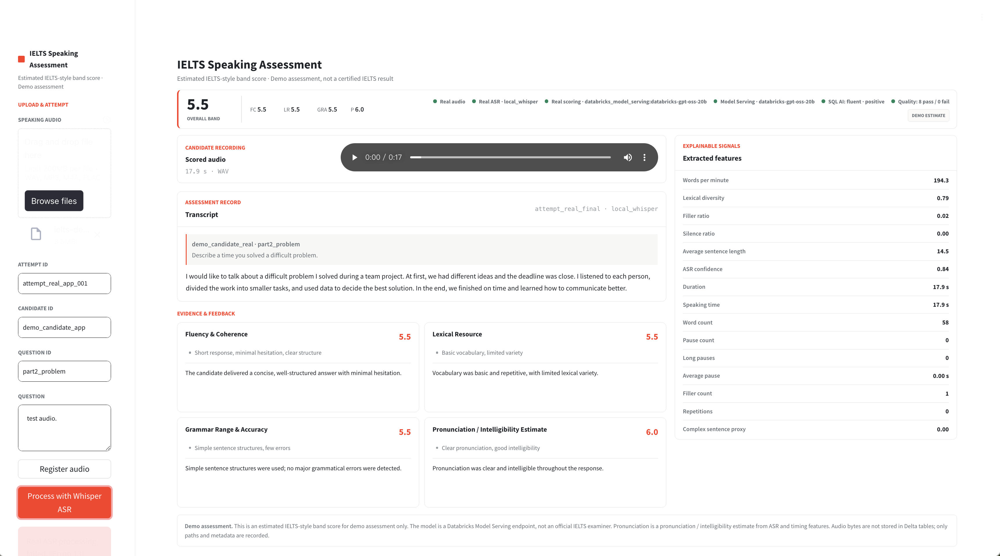

# Databricks IELTS Speaking Audio Scoring Demo

[](https://github.com/rzblues/databricks-ielts-speaking-demo/actions/workflows/test.yml)
[](https://www.python.org/downloads/)
[](https://ielts-speaking-demo-7474646798897087.aws.databricksapps.com)

An end-to-end Databricks customer demo for IELTS Speaking audio assessment: real audio bytes, Whisper ASR, explainable features, Model Serving, Delta tables, MLflow, SQL AI, and a Streamlit App.



**[Open the live Databricks App](https://ielts-speaking-demo-7474646798897087.aws.databricksapps.com)** *(Databricks sign-in and `CAN USE` permission required)* · **[Download the solution deck](docs/ielts-speaking-databricks-solution.pptx)** · **[Deployment guide](#deploy-to-your-databricks-workspace)**

## What This Demonstrates

- Real audio playback and non-mock Whisper transcription on Databricks compute.
- Explainable IELTS-style dimension estimates backed by Model Serving and speech features.
- Governed Delta records with MLflow tracking, SQL AI insights, and quality checks.

The demo starts from an audio attempt record, transcribes it through an ASR boundary or mock fallback, extracts explainable speech/language features, estimates IELTS-style speaking bands, writes table-shaped records, and renders a report.

It is not an official IELTS examiner and does not produce a certified IELTS score.

## Primary Databricks Path

The primary demo path is Databricks:

```text
real or synthetic demo audio
  -> Whisper ASR on Databricks compute
  -> explainable features
  -> Databricks Model Serving scorer
  -> main.ielts_demo Delta tables
  -> Databricks App / Streamlit report
```

The project keeps mock ASR and mock LLM as stable fallbacks. The platform enhancement path uses Databricks Model Serving for live model scoring, MLflow for tracking, a feature lifecycle table, SQL quality checks, Lakehouse monitor setup, and SQL AI function insights. See `DATABRICKS_ML_PLATFORM_ENHANCEMENT_LOOP.md`.

`sample_data/audio/synthetic_demo.wav` is generated speech containing no candidate data. It is included only so a fresh clone can exercise the real-audio-byte and non-mock ASR path safely.

## Modes

- `MOCK_ASR=true`: use `sample_data/mock_transcripts.json`.
- `MOCK_LLM=true`: use deterministic local scoring.
- `DATABRICKS_DEMO=true`: use notebooks and Delta tables where workspace permissions allow.

Local output exists only as a test fallback, not as the main demo.

## Databricks Setup

```bash
databricks auth login --profile DEFAULT
python scripts/probe_databricks.py
python scripts/databricks_smoke.py
python scripts/publish_feature_table.py
python scripts/run_sql_ai_insights.py
python scripts/run_quality_checks.py
python scripts/log_mlflow_baseline.py
DATABRICKS_MODEL_ENDPOINT=databricks-gpt-oss-20b python scripts/score_with_model_serving.py
```

The smoke script writes one sample attempt into:

- `main.ielts_demo.attempts`
- `main.ielts_demo.asr_segments`
- `main.ielts_demo.speech_features`
- `main.ielts_demo.scoring_results`
- `main.ielts_demo.speech_feature_table`
- `main.ielts_demo.feature_lifecycle_events`
- `main.ielts_demo.quality_check_results`
- `main.ielts_demo.ai_function_insights`

Expected smoke output:

```text
attempts=1
asr_segments=5
speech_features=1
scoring_results=1
```

## Deploy To Your Databricks Workspace

Install the Databricks CLI, authenticate, and choose a SQL warehouse ID from your workspace:

```bash
git clone https://github.com/rzblues/databricks-ielts-speaking-demo.git
cd databricks-ielts-speaking-demo
databricks auth login
databricks bundle validate --var="warehouse_id=<your-sql-warehouse-id>"
databricks bundle deploy --var="warehouse_id=<your-sql-warehouse-id>"
```

The bundle deploys the pipeline notebooks and job. The preferred namespace is `main.ielts_demo`; update it in the SQL and application configuration if your workspace uses another catalog or schema.

To deploy the UI from public Git:

1. In **Databricks Apps**, create a custom app and select **Git repository**.
2. Use `https://github.com/rzblues/databricks-ielts-speaking-demo` with branch `main`.
3. Add a SQL warehouse resource named `sql-warehouse` with `CAN_USE`.
4. Add the Unity Catalog volume `main.ielts_demo.ielts_audio` as `audio-volume` with `WRITE_VOLUME`.
5. Add `databricks-gpt-oss-20b` as a Model Serving resource named `scoring-endpoint` with `CAN_QUERY`.
6. Deploy from the repository root. Public repositories do not require a Git credential.

The App uses its Databricks service principal through `WorkspaceClient()`; do not put a personal access token in `app.yaml` or source control.

## Current Demo

Current deployed App:

[ielts-speaking-demo](https://ielts-speaking-demo-7474646798897087.aws.databricksapps.com) *(Databricks sign-in and `CAN USE` permission required)*

## Local Quality Checks

Use Python 3.11 or newer.

```bash
python -m pip install -e ".[dev]"
python -m pytest -q
python scripts/run_mock_demo.py
```

Outputs:

- `outputs/attempt_sample_001_report.json`
- `outputs/attempt_sample_001_report.md`
- `outputs/local_tables/attempts.jsonl`
- `outputs/local_tables/asr_segments.jsonl`
- `outputs/local_tables/speech_features.jsonl`
- `outputs/local_tables/scoring_results.jsonl`

These outputs are for tests and fallback evidence only. The customer demo should use Databricks tables.

## Databricks App

The repo contains root-level `app.yaml` and `requirements.txt` for Databricks Apps. In Databricks Apps, the app first uses the service principal identity supplied through `WorkspaceClient()`; no personal token is embedded in the deployment. The SQL connector variables below are an optional fallback for non-App environments:

- `DATABRICKS_SERVER_HOSTNAME`
- `DATABRICKS_HTTP_PATH`
- `DATABRICKS_TOKEN` or equivalent secure app secret
- `DATABRICKS_NAMESPACE`

`ALLOW_LOCAL_REPORT_FALLBACK` defaults to `false`. A Databricks read failure therefore stops the report view instead of silently displaying sample data.

For local smoke only:

```bash
ALLOW_LOCAL_REPORT_FALLBACK=true DATABRICKS_DEMO=false streamlit run app/app.py
```

The Databricks App has a one-step real-audio workflow. Selecting a file generates a new editable `attempt_id`; `Run speaking assessment` uploads it to the governed Volume, runs `openai-whisper` on Databricks App compute, scores it through the configured Databricks Model Serving endpoint, and writes the attempt, ASR segments, features, and model report to Delta. The candidate and question fields are report metadata and should match the uploaded response.

The App shows the live endpoint provider in Provenance. It also displays candidate/audio metadata, the latest SQL AI insight, and the latest result for each quality check.

For longer audio or batch processing, use the notebook/job path instead of the App button.

## Notebook Order

```text
notebooks/00_setup.sql
notebooks/01_ingest_audio.py
notebooks/02_transcribe.py
notebooks/03_extract_features.py
notebooks/04_score_with_llm.py
notebooks/10_score_with_model_serving.py
notebooks/07_publish_feature_table.py
notebooks/09_run_sql_ai_insights.py
notebooks/08_run_quality_checks.py
notebooks/06_log_mlflow_baseline.py
notebooks/05_review_results.py
```

Preferred namespace: `main.ielts_demo`.

Deploy and run the Databricks-first pipeline:

```bash
databricks bundle deploy --var="warehouse_id=<your-sql-warehouse-id>"
databricks bundle run ielts_speaking_demo_pipeline
```

This workspace supports Serverless Jobs only, so the bundle intentionally does not define a classic job cluster. All tasks still execute on Databricks-managed compute.

If schema creation is not permitted, use a schema where you have `USE_SCHEMA` and `CREATE_TABLE`, then update the notebook table names.

## Data Handling

- Do not commit real candidate audio.
- Do not log full audio bytes.
- The Delta contract stores audio paths and metadata, not audio payloads.
- All outputs are keyed by `attempt_id`.
- Demo outputs under `outputs/` can be deleted at any time.
- Uploaded candidate audio remains in `/Volumes/main/ielts_demo/ielts_audio` until explicitly deleted with `databricks fs rm dbfs:/Volumes/main/ielts_demo/ielts_audio/<attempt-file>` or an equivalent governed retention job.
- Delete an attempt's derived records from `attempts`, `asr_segments`, `speech_features`, `scoring_results`, `processing_runs`, `ai_function_insights`, and the feature table by `attempt_id`; deleting Delta metadata does not delete the Volume file.
- The demo does not implement an automatic retention period. Set one before using real candidate data beyond a controlled demonstration.

## Current Capability Status

See `docs/databricks_capability_probe.md`.

The local mock demo remains the reliable fallback. Databricks Apps, SQL Warehouse, Unity Catalog, Model Serving, MLflow, Lakehouse Monitoring, and SQL AI functions have been verified in the target workspace for this demo loop.
